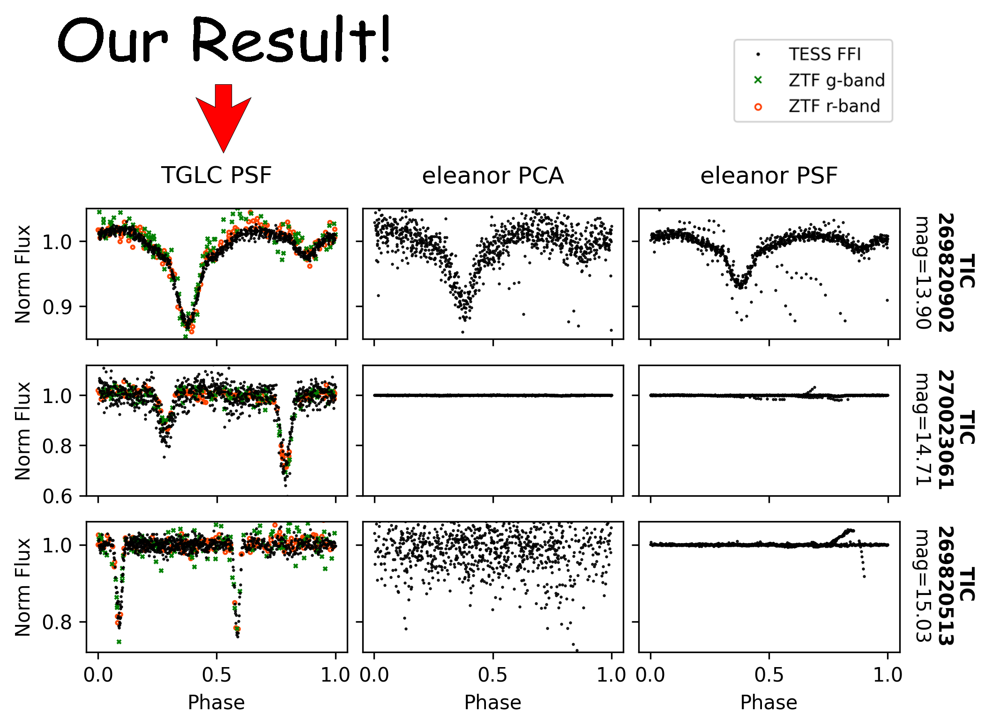

.. image:: logo/TGLC_Title.png
  :width: 800
  :alt: TESS-Gaia Light Curve
.. image:: https://zenodo.org/badge/420868490.svg
   :target: https://zenodo.org/badge/latestdoi/420868490
.. image:: https://static.pepy.tech/personalized-badge/tglc?period=total&units=international_system&left_color=grey&right_color=blue&left_text=Total%20Downloads
   :target: https://pepy.tech/project/tglc
.. image:: https://img.shields.io/badge/Cite-TGLC-blue
   :target: https://www.tomwagg.com/software-citation-station/?auto-select=tglc
==================================
Introduction
==================================

TESS-Gaia Light Curve (`TGLC <https://archive.stsci.edu/hlsp/tglc>`_) is a dataset of TESS full-frame image light curves publicly available via the MAST portal. It is fitted with effective PSF and decontaminated with Gaia DR3 and achieved percent-level photometric precision down to 16th TESS magnitude! It unlocks astrophysics to a vast number of dim stars below 12th TESS magnitude. A package called tglc is pip-installable for customized light curve fits.

==================================
Usage
==================================
There are four fluxes in each FITS file: aperture flux, PSF flux, calibrated aperture flux, and calibrated PSF flux.
If you are uncertain which to use:

* Calibrated psf flux is better in **deblending** targets. Use this if you need to deblend a target near a variable source. The best deblending can be achieved with tglc package by setting a non-zero prior. It also gives the more accurate **transit depth** in most cases, especially when fitting with an optimized prior.
* Calibrated aperture flux usually has slightly **higher SNR**. The transit depth (or variation amplitude), however, can be imperfect since the normalization depends on the PSF fitting which is imperfect. This imperfection can be minimized by using a bigger aperture than the default aperture (3*3). One need to use the tglc package and set tglc_lc(save_aper=True) to access the 5*5 aperture. In the presence of a bright but "constant" contamination (several magnitudes brighter), the calibrated aperture flux is better in removing the constant contamination. 
* The aperture flux and PSF flux are not detrended or normalized. Use this if you are doing stellar variability science with long baseline. Or, if the detrending is not optimal (default detrending has a window length of 1 day; see Known Problems below), start with the aperture flux or PSF flux and detrend carefully!
* **If you are uncertain, start with calibrated aperture flux!**

The `tutorial <tutorial/TGLC_tutorial.ipynb>`_ shows the syntaxes and differences among these light curves in several examples.

==================================
Data Access
==================================
There are three data access methods:

* MAST Portal: Easiest for acquiring light curves for a few stars. However, new sectors are updated relatively slowly. 
* MAST bulk download: Best for downloading light curves for all stars (<16 TESS magnitude) in a sectors. 
* tglc package: Capable of producing similar quality light curves for any sector and any star with custom options. 

MAST Portal/bulk download
----------------------------
The easiest usage requires no package installation. Simply follow the `TGLC HLSP page <https://archive.stsci.edu/hlsp/tglc>`_ to download light curves from MAST or use `MAST Portal <https://mast.stsci.edu/portal/Mashup/Clients/Mast/Portal.html>`_. Light curves are being fitted sector by sector and will be available on MAST gradually. MAST hosts all Gaia DR3 stars down to 16th magnitude. Each .fits file includes PSF and aperture light curves and their calibrated versions.

MAST available sectors: `sector worklist <https://docs.google.com/spreadsheets/d/1FhHElWb1wmx9asWiZecAJ2umN0-P_aXn55OBVB34_rg/edit?usp=sharing>`_

tglc package
----------------------------
Users can also fit light curves using the package tglc. Using tglc, one can specify a region, sector(s), and customized aperture shape if needed. It can also allow all field stars to float by assigning Gaussian priors, which can help decontaminate variable field stars. tglc is currently only available for linux. Run::

  pip install tglc
  
for the latest tglc release. After installation, follow the `tutorial <tutorial/TGLC_tutorial.ipynb>`_ to fit light curves. If there is a problem, please leave a comment in the Issues section to help us improve. Thank you!

==================================
Known Problems
==================================
There are several imperfections we noticed in the MAST TGLC light curves and tglc package:

* If the star is very dim (~< 15 Tmag) near a variable source, it can make the aperture and/or PSF light curve negative for some cadences. The detrending algorithm could malfunction and result in bad cal_aper_flux and/or cal_psf_flux. This is now fixed for tglc package, but this problem remains for the primary mission light curves published on MAST. Please detrend again if necessary. The extended mission light curves on MAST will not be affected. This is a very rare scenario, but could be important.

==================================
Reference
==================================
If you find the TGLC light curves or the tglc package useful in your research, please cite `our paper <https://iopscience.iop.org/article/10.3847/1538-3881/acaaa7>`_ published on the Astronomical Journal. 
