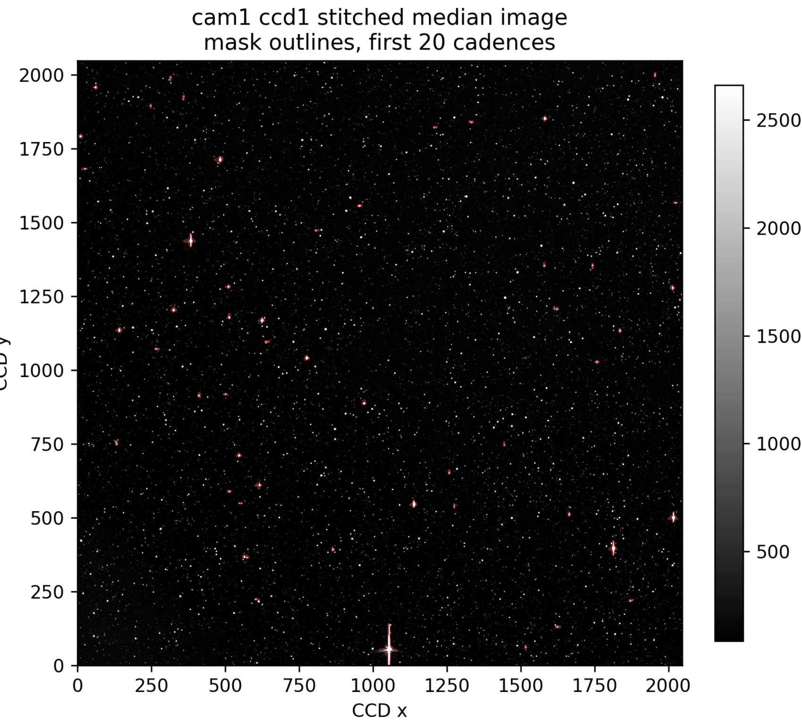

ePSF Fitting Masks
==================

TGLC can exclude image pixels that are contaminated by saturated stars or
bleed trails when fitting the effective PSF shape. These pixels can otherwise
enter the ePSF design matrix as ordinary detector samples and bias the fitted
shape or normalization of nearby cutouts.

The mask is built from the image data for each cutout. It looks for very bright
seed pixels, grows those regions at a lower threshold, keeps long horizontal or
vertical runs that are characteristic of bleed trails, and then applies a small
dilation. The resulting mask is static for the cutout and is combined with the
existing pixel-row mask in the ePSF fit.

Only contaminated pixel rows are removed from the ePSF fitting linear system.
The catalog star models are still present in the design matrix, and normal
pixels from the same cutout continue to constrain the ePSF.

   Sector 56, camera 1, CCD 1 median image. Red outlines mark pixels excluded
   from the ePSF fitting step because they are consistent with saturated or
   bleeding contamination.

Experimental Options
--------------------

The current experimental branch exposes the mask as an opt-in ePSF option:

.. code-block:: python

   epsf(
       ...,
       flux_scale="tmag10",
       epsf_normalization="unit_sum",
       overexposure_mask=True,
   )

The sector 56 comparison runner is available at
``scripts/run_s56_tmag10_unit_bleedmask.py``. It writes products into a
separate experiment root so the standard sector archive is not modified.

The bleed mask is scientifically useful where saturated stars or bleed trails
are present. It should remain opt-in until full-sector comparisons show that it
improves contaminated regions without degrading ordinary light curves.
