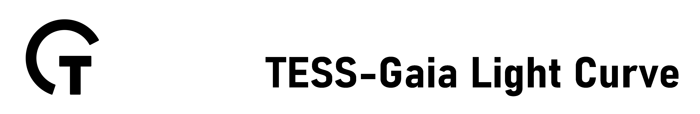

.. TESS Gaia Light Curve documentation master file, created by
   sphinx-quickstart on Fri May 27 15:55:29 2022.
   You can adapt this file completely to your liking, but it should at least
   contain the root `toctree` directive.

Welcome to TESS Gaia Light Curve's documentation!
=================================================
Check out the :doc:`usage` section for further information.

.. toctree::
   :maxdepth: 2
   :caption: Contents:

Indices and tables
==================

* :ref:`genindex`
* :ref:`modindex`
* :ref:`search`

Contents
--------

.. toctree::

   usage
   api